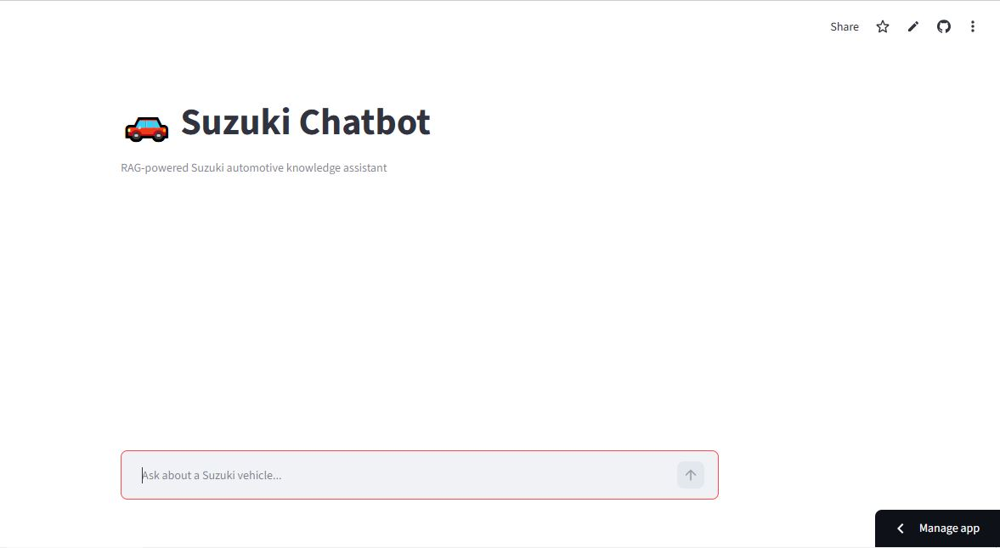
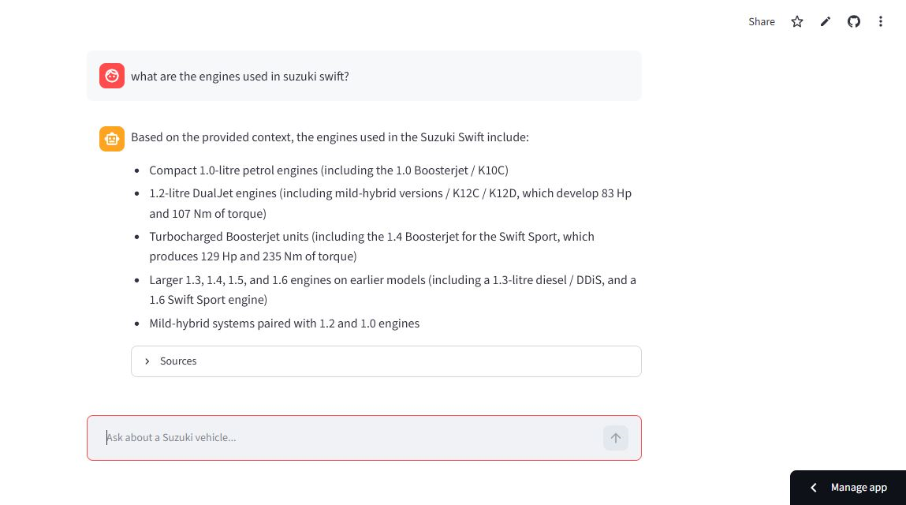

# 🚗 Suzuki Automotive RAG Chatbot

> A hybrid Retrieval-Augmented Generation (RAG) system for answering Suzuki automotive questions using semantic retrieval, keyword search, Reciprocal Rank Fusion, cross-encoder reranking, and grounded Gemini generation.

<p align="center">

[](https://suzuki-rag-chatbot-mbxyxhcxvxwj4qmnxtnm5q.streamlit.app/)
[](https://www.python.org/)
[](https://streamlit.io/)
[](https://www.trychroma.com/)
[](https://github.com/dorianbrown/rank_bm25)
[](https://ai.google.dev/)
[](LICENSE)

</p>

<p align="center">
  <a href="https://suzuki-rag-chatbot-mbxyxhcxvxwj4qmnxtnm5q.streamlit.app/">
    <strong>🚀 Try the Live Chatbot</strong>
  </a>
</p>

---

## 📸 Demo

<p align="center">
  
</p>

<p align="center">
  
</p>

---

## 📌 Overview

This project is an end-to-end Retrieval-Augmented Generation (RAG) application designed to answer Suzuki automotive questions using a domain-specific knowledge base.

Instead of relying solely on an LLM's pretrained knowledge, the system first retrieves relevant information using two complementary retrieval strategies:

- **Dense semantic retrieval** using BGE embeddings and ChromaDB
- **Sparse keyword retrieval** using BM25

The two retrieval rankings are then combined using **Reciprocal Rank Fusion (RRF)** and refined through **cross-encoder reranking** before the final context is sent to Gemini.

The generation layer uses explicit grounding instructions so that the model answers from the retrieved context and reports conflicting source information when it exists.

The application is deployed publicly using **Streamlit Community Cloud**.

### What this project demonstrates

- End-to-end RAG architecture
- Hybrid semantic + keyword retrieval
- Reciprocal Rank Fusion
- Cross-encoder reranking
- Grounded LLM generation
- Source-aware answers
- Persistent vector and keyword indexes
- Git LFS for large retrieval artifacts
- Streamlit cloud deployment

---

## 🏗️ Architecture

The application follows a retrieval-first RAG architecture in which retrieval, ranking, and generation are separate stages.

```text
                         ┌──────────────────────┐
                         │      User Query      │
                         └──────────┬───────────┘
                                    │
                                    ▼
                     ┌──────────────────────────┐
                     │     BGE Query Encoder    │
                     │  bge-base-en-v1.5 (768D) │
                     └─────────────┬────────────┘
                                   │
                    ┌──────────────┴──────────────┐
                    │                             │
                    ▼                             ▼
          ┌──────────────────┐          ┌──────────────────┐
          │    ChromaDB      │          │       BM25       │
          │ Semantic Search  │          │ Keyword Search   │
          └────────┬─────────┘          └────────┬─────────┘
                   │                             │
                   └─────────────┬───────────────┘
                                 ▼
                    ┌─────────────────────────┐
                    │ Reciprocal Rank Fusion  │
                    │          (RRF)           │
                    └────────────┬────────────┘
                                 │
                                 ▼
                    ┌─────────────────────────┐
                    │   BGE Cross-Encoder     │
                    │       Reranker           │
                    └────────────┬────────────┘
                                 │
                                 ▼
                    ┌─────────────────────────┐
                    │   Top Relevant Context  │
                    │      (Top 3 Chunks)      │
                    └────────────┬────────────┘
                                 │
                                 ▼
                    ┌─────────────────────────┐
                    │    Gemini Generation    │
                    │     Temperature = 0     │
                    │     Grounded Prompt     │
                    └────────────┬────────────┘
                                 │
                                 ▼
                    ┌─────────────────────────┐
                    │   Answer + Source Links │
                    └─────────────────────────┘
```

### Retrieval Flow

```text
User Query
    │
    ▼
BGE Query Embedding
    │
    ├──────────────► ChromaDB
    │                  │
    │                  ▼
    │             Dense Results
    │
    └──────────────► BM25
                       │
                       ▼
                  Keyword Results
                       │
                       └──────────────┐
                                      ▼
                               Reciprocal Rank
                                  Fusion (RRF)
                                      │
                                      ▼
                             Cross-Encoder
                                Reranking
                                      │
                                      ▼
                               Top 3 Context
                                      │
                                      ▼
                                  Gemini
                                      │
                                      ▼
                              Grounded Answer
```

---

## 🔧 Key Engineering Decisions

### 1. Hybrid Retrieval: ChromaDB + BM25

A single retrieval method can miss relevant information.

The system combines:

- **Dense retrieval** for semantic similarity
- **BM25** for exact keyword and terminology matching

This is particularly useful for automotive questions containing model names, measurements, engine sizes, prices, and technical terminology.

---

### 2. Reciprocal Rank Fusion (RRF)

The outputs from ChromaDB and BM25 are ranked independently.

Instead of directly comparing their raw scores, the system combines their rankings using **Reciprocal Rank Fusion**.

```text
Chroma ranking ──┐
                 ├──► RRF ──► Unified candidate ranking
BM25 ranking ────┘
```

RRF allows the system to combine different retrieval signals without requiring their raw scores to be directly comparable.

---

### 3. Cross-Encoder Reranking

The RRF candidate set is passed through a BGE cross-encoder reranker.

Unlike the initial embedding retrieval stage, the cross-encoder evaluates the query and candidate document together to refine the relevance ranking.

```text
Query + Candidate Chunk
          │
          ▼
   Cross-Encoder
          │
          ▼
  Relevance Score
```

The highest-ranked chunks are then selected as the final context for Gemini.

---

### 4. Retrieval-First Generation

The LLM is not used as the primary knowledge source.

Instead, the application follows:

```text
Question
   ↓
Retrieve evidence
   ↓
Fuse retrieval signals
   ↓
Rerank evidence
   ↓
Build focused context
   ↓
Generate answer
```

This separation makes retrieval quality independently testable from the generation layer.

---

### 5. Conflict-Aware Generation

Automotive specifications can vary between sources, model years, markets, and variants.

The generation layer therefore instructs Gemini to explicitly report conflicting values rather than silently selecting or inventing one.

For example, when multiple retrieved sources provide different values for a specification, the chatbot can surface the disagreement to the user.

---

### 6. Modular RAG Pipeline

Retrieval, reranking, and generation are separated into independent modules:

```text
rag/
├── retrieval.py
├── reranking.py
└── generation.py
```

This makes the system easier to:

- evaluate
- debug
- test
- replace individual components
- compare retrieval strategies
- extend in future versions

---

### 7. Persistent Retrieval Artifacts

The vector database and BM25 index are built ahead of time and persisted as application artifacts.

This avoids rebuilding embeddings and indexes every time the application starts.

Large retrieval artifacts are managed using **Git LFS**.

---

## 🧪 Evaluation & Results

The retrieval pipeline was evaluated progressively to compare semantic retrieval, keyword retrieval, and hybrid retrieval.

### Retrieval Evaluation

A representative evaluation set was used to compare the retrieval strategies.

| Retrieval Strategy | Recall@5 |
|---|---:|
| ChromaDB (Dense) | **80%** |
| BM25 (Sparse) | **100%** |
| RRF (Hybrid) | **100%** |

The evaluation showed that BM25 recovered relevant keyword-heavy results that dense retrieval occasionally missed. Combining both retrieval signals with RRF improved the candidate set.

> **Note:** This was a small sanity-check evaluation rather than a statistically significant benchmark. The purpose was to validate the retrieval pipeline and compare the behavior of the different retrieval strategies.

---

### End-to-End Generation Evaluation

The complete pipeline was tested with representative automotive questions covering:

- engine information
- vehicle pricing
- ground clearance
- platform relationships
- vehicle dimensions

The evaluation highlighted an important RAG behavior:

> **Retrieval quality directly influences generation quality.**

When retrieved sources contained conflicting specifications, the final Gemini-based generation layer was instructed to surface the conflict rather than silently selecting an unsupported value.

For example, the Fronx ground-clearance query retrieved multiple conflicting values, and the chatbot explicitly reported the disagreement.

Similarly, the Jimny dimensions query retrieved different dimension sets from different sources, and the answer identified the conflict.

---

### Evaluation Pipeline

```text
Dense Retrieval
      +
Sparse Retrieval
      ↓
     RRF
      ↓
Cross-Encoder Reranking
      ↓
Focused Context
      ↓
Grounded Generation
```

The evaluation reinforced the importance of treating **retrieval, ranking, and generation as separate engineering stages**.

---

## 🛠️ Tech Stack

| Layer | Technology | Role |
|---|---|---|
| Language | Python | Application and RAG pipeline |
| Embeddings | `BAAI/bge-base-en-v1.5` | Semantic query/document representation |
| Vector Database | ChromaDB | Dense vector retrieval |
| Keyword Retrieval | BM25 | Lexical and exact-term retrieval |
| Fusion | Reciprocal Rank Fusion | Combines dense + sparse rankings |
| Reranking | `BAAI/bge-reranker-base` | Query-document relevance reranking |
| LLM | Gemini | Grounded answer generation |
| UI | Streamlit | Interactive chatbot interface |
| Version Control | Git + GitHub | Source control |
| Large Artifacts | Git LFS | Retrieval index storage |
| Deployment | Streamlit Community Cloud | Public application hosting |

---

## 📊 Retrieval Configuration

| Parameter | Configuration |
|---|---|
| Embedding model | `BAAI/bge-base-en-v1.5` |
| Embedding dimension | 768 |
| Dense retrieval | ChromaDB |
| Sparse retrieval | BM25 |
| RRF constant | 60 |
| Candidates per retriever | Top 10 |
| RRF candidates | Top 10 |
| Reranker | `BAAI/bge-reranker-base` |
| Final context | Top 3 chunks |
| Generation model | Gemini |
| Generation temperature | 0 |

---

## 📁 Project Structure

```text
suzuki-rag-chatbot/
│
├── app.py
├── README.md
├── requirements.txt
├── LICENSE
├── .gitignore
├── .gitattributes
│
├── screenshots/
│   ├── 1.png
│   └── 2.png
│
├── rag/
│   ├── __init__.py
│   ├── retrieval.py
│   ├── reranking.py
│   └── generation.py
│
└── data/
    ├── bm25_v1.pkl
    └── chroma_v2/
```

### Module Responsibilities

#### `app.py`

Streamlit application layer responsible for:

- chat interface
- conversation display
- answer presentation
- source display
- user interaction

#### `rag/retrieval.py`

Retrieval layer responsible for:

- BGE query embedding
- ChromaDB semantic retrieval
- BM25 keyword retrieval
- Reciprocal Rank Fusion

#### `rag/reranking.py`

Reranking layer responsible for:

- cross-encoder inference
- query-document relevance scoring
- final candidate ordering

#### `rag/generation.py`

Generation layer responsible for:

- context construction
- grounded prompt creation
- Gemini API interaction
- final answer generation

#### `data/`

Contains the persisted retrieval artifacts required by the application:

- BM25 index
- ChromaDB vector database

---

## 🚀 Getting Started

### Prerequisites

- Python 3.x
- Git
- Git LFS
- Gemini API key

### 1. Clone the Repository

```bash
git clone https://github.com/prithivnagarajan293-png/suzuki-rag-chatbot.git
cd suzuki-rag-chatbot
```

### 2. Create a Virtual Environment

```bash
python -m venv .venv
```

Activate it on Windows:

```powershell
.venv\Scripts\Activate.ps1
```

### 3. Install Dependencies

```bash
pip install -r requirements.txt
```

### 4. Configure Gemini API

Windows PowerShell:

```powershell
$env:GEMINI_API_KEY="YOUR_API_KEY"
```

Linux / macOS:

```bash
export GEMINI_API_KEY="YOUR_API_KEY"
```

**Never commit API keys or other secrets to GitHub.**

### 5. Run the Application

```bash
streamlit run app.py
```

This starts the chatbot locally for development and testing.

---

## ☁️ Deployment

The application is deployed using **Streamlit Community Cloud**.

Large retrieval artifacts are managed with **Git LFS**, while the Gemini API key is supplied through the deployment environment.

### Live Application

👉 **[Open the Suzuki RAG Chatbot](https://suzuki-rag-chatbot-mbxyxhcxvxwj4qmnxtnm5q.streamlit.app/)**

---

## 🔐 Security

API credentials are intentionally excluded from source control.

The Gemini API key is configured through environment variables during local development and through deployment secrets in the hosted environment.

---

## ⚠️ Data & Accuracy Disclaimer

This project demonstrates RAG architecture and retrieval engineering.

Automotive specifications can vary by:

- market
- model year
- trim
- vehicle variant
- source

When retrieved sources contain conflicting information, the chatbot is designed to surface the disagreement rather than silently assume a single value.

---

## 🔮 Future Improvements

Potential future improvements include:

- larger automated RAG evaluation datasets
- retrieval latency monitoring
- answer-quality scoring
- query classification and routing
- improved source citation UX
- observability and tracing
- automated CI checks
- retrieval and model A/B evaluation

---

## 👨‍💻 Author

**Prithiv Nagarajan**

AI / Data Engineering projects focused on:

- Generative AI
- Retrieval-Augmented Generation
- Data Engineering
- AI data pipelines
- LLM applications

---

## ⭐ Why This Project?

This project demonstrates more than calling an LLM API.

It implements the complete path from:

**retrieval engineering → ranking → grounded generation → application deployment**

The architecture keeps retrieval, reranking, and generation as separate components, making the system easier to evaluate, debug, and extend.